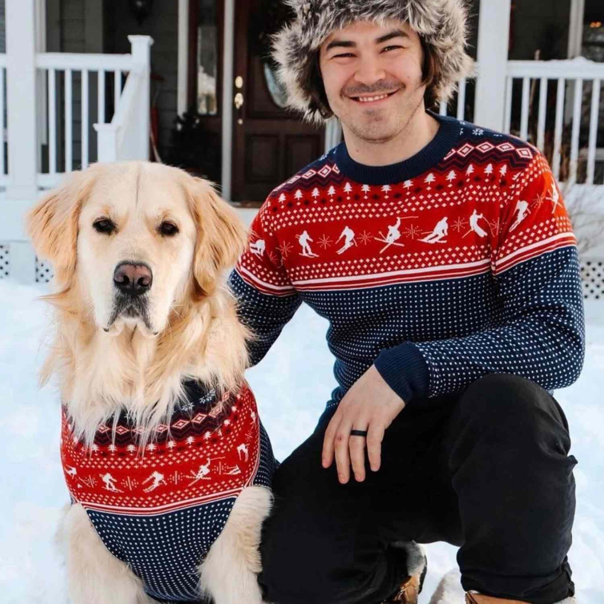

# Preliminaries

## Reminders

- For today, the reading was Chapter 3, "What Makes You You?"
- Because of Labor Day, we are shifted: today is the day that I will mostly lecture; next Monday will be more activity based.
- Next Wednesday, Sep 16th, is our first midterm.

# "Identity"

## An Ambiguity

The word 'same' is used to express *identity*. But it is ambiguous, and so is the word 'identical'.^[An ambiguous word is a word with more than one meaning.]

-   "We wore the **same** sweater to the party."
-   "Your sweater is **identical** to mine."

What are the two possible meanings of 'same' or 'identical' here?

## "the *same* sweater" {.center}

::: {.r-hstack}
::: {data-id="qual-id" .fragment style="width: 300px; margin: 10px; text-align: center; align-content:baseline"}

{width="300" .lightbox}

qualitative sameness
:::

::: {data-id="num-id" .fragment style="width:300px; margin: 10px; text-align: center; align-content:baseline"}
{width="300" .lightbox}

numerical sameness

:::

:::

## Numerical Identity

-   This is a relation between a thing and *itself*, never between a thing and *something else*.
-   When we say that $a$ is numerically identical to $b$, we are using two different labels for one thing.
-   When we say that Superman is numerically identical to Clark Kent, we are using two different names for one thing.
-   A difference in labels or names does not imply a different in objects: one object can have more than one label or name.

## Qualitative Identity

-   This is a relation that can hold between a thing and itself, but can also hold between a thing and something else.
-   When we say that $a$ is qualitatively identical to $b$, we are saying that they are **very similar** to each other.

## Numerical or Qualitative? {contenteditable=true}

1. Hannah Montana is identical to Miley Stewart.
2. Every box of cheerios is the same as every other.
3. Samuel Clemens is identical to Mark Twain.
4. Everyone you date is the same---stop dating losers!
5. Darth Vader is Luke's father.
6. Snoop Dogg is the same as Snoop Lion.

# Identity Over Time

## Identity over Time

The puzzles we are going to be thinking about all have to do with numerical identity **over time**. What makes the kid in the photo on the left the same person as the adult in the photo on the right?

::: {.r-hstack}
::: {data-id="num-id" style="width:300px; margin: 10px; text-align: center; align-content:baseline"}
{height="300" .lightbox}

$A$ at $t$

:::
::: {data-id="qual-id" style="width: 300px; margin: 10px; text-align: center; align-content:baseline"}

{height="300" .lightbox}

$B$ at $t^*$
:::
:::

## Change and Identity over Time {.smaller}

> You might think: "Wait a minute! I'm
not the same as that kid in the photo. We're different in all sorts of ways.
In fact, I'm changing every second, so I'm not even the same from one *moment*
to the next. I'm not even the same person as the person who started this
sentence!" 

-   You are not **qualitatively the same**, but you are **numerically the same**.
-   Change just is **numerical identity** despite **qualitative difference**, over time: 
    -   you now are the *(numerically) same thing* as you as a kid, even though you are *(qualitatively) different* from how you were.

# Necessary and Sufficient Conditions

## Template of an Account

We are looking for a way to fill in the blank in the following template:

$A$ at time $t$ is the same person as $B$ at time $t^*$ **if and only if**
:   [\ \ *proposed condition* \ \ ]{style="text-decoration:underline"}.

That is, we are looking for a condition that is both **necessary** and **sufficient** for being the same person at two different times.

## 'if and only if' {auto-animate=true auto-animate-easing="ease-in-out"}

## 'if and only if'

This is a logical phrase that is often used when given definitions, or when attempting to analyze something. For example:

$S$ is a rectangle **if and only if**
:   $S$ is a four-sided polygon with equal interior angles.

The condition that occurs on the right-hand side of 'if and only if' is a **necessary and sufficient** condition for being a rectangle.

## 'if' and 'only if'

Sufficient Condition
:   $S$ is a rectangle **if** $S$ is a four-sided polygon with equal interior angles.

Necessary Condition
:   $S$ is a rectangle **only if** $S$ is a four-sided polygon with equal interior angles.

The first says that being a four-sided polygon with equal interior angles is **enough** to make $S$ a rectangle.

The second says that it is **required** for $S$ to be a rectangle.

## Sufficient Conditions {auto-animate=true}

Here is an example of a **sufficient condition** for being a rectangle that is not a **necessary condition**:

-   $S$ is a rectangle **if** $S$ is a square.

To be a rectangle, being a square is **enough**, but not **required**.

::: {.r-hstack}
::: {data-id="box1" auto-animate-delay="0" style="background: #4A90E2; width: 300px; height: 300px; border-radius: 200px; margin: 10px; text-align: center; align-content:center"}
rectangles
:::

::: {data-id="box2" auto-animate-delay="0.1" style="background: #F5A62390; width: 300px; height: 300px; border-radius: 200px; margin: 10px; text-align: center; align-content: center"}
squares
:::
:::

---

-   $S$ is a rectangle **if** $S$ is a square.

::: {.r-stack}
::: {data-id="box2" style="background: #F5A62390; width: 500px; height: 500px; border-radius: 400px; text-align: center; padding: 2em !important"}
rectangles
:::

::: {data-id="box1" style="background: #4A90E2; width: 300px; height: 300px; border-radius: 200px; text-align: center; align-content:center"}
squares
:::

:::

## Necessary Conditions {auto-animate=true}

Here is an example of a **necessary condition** that is not **sufficient**:

-   $S$ is a rectangle **only if** $S$ is a four-sided polygon.

Being four-sided is **required**, but not **enough**.

::: {.r-hstack}
::: {data-id="box3" auto-animate-delay="0" style="background: #4A90E2; width: 300px; height: 300px; border-radius: 200px; margin: 10px; text-align: center; align-content:center"}
rectangles
:::

::: {data-id="box4" auto-animate-delay="0.1" style="background: #F5A62390; width: 300px; height: 300px; border-radius: 200px; margin: 10px; text-align: center; align-content: center"}
four-sided polygons
:::
:::

---

-   $S$ is a rectangle **only if** $S$ is a four-sided polygon.

::: {.r-stack}
::: {data-id="box4" style="background: #F5A62390; width: 500px; height: 500px; border-radius: 400px; text-align: center; padding: 2em !important"}
four-sided polygons
:::

::: {data-id="box3" style="background: #4A90E2; width: 300px; height: 300px; border-radius: 200px; text-align: center; align-content:center"}
rectangles
:::

:::

## Necessary and Sufficient Conditions {auto-animate=true}

$S$ is a rectangle **if and only if**
:   $S$ is a four-sided polygon with equal interior angles.

Finally, a feature that is both **required** and **enough**.

::: {.r-hstack}
::: {data-id="box5" auto-animate-delay="0" style="background: #4A90E2; width: 300px; height: 300px; border-radius: 200px; margin: 10px; text-align: center; align-content:center"}
rectangles
:::

::: {data-id="box6" auto-animate-delay="0.1" style="background: #F5A62390; width: 300px; height: 300px; border-radius: 200px; margin: 10px; text-align: center; align-content: center"}
four-sided polygons with equal interior angles
:::
:::

---

$S$ is a rectangle **if and only if**
:   $S$ is a four-sided polygon with equal interior angles.

::: {.r-stack}
::: {data-id="box6" style="background: #F5A62390; width: 400px; height: 400px; border-radius: 400px; text-align: center; padding: 2em !important"}
four-sided polygons with equal interior angles
:::

::: {data-id="box5" style="background: #4A90E250; width: 400px; height: 400px; border-radius: 400px; text-align: center; align-content:center; padding: 2em !important"}
rectangles
:::

:::

## Template of an Account {auto-animate=true}

$A$ at time $t$ is the same person as $B$ at time $t^*$ **if and only if** 
:    [\ \ *proposed condition*\ \ ]{style="text-decoration:underline"}

Can we come up with a condition that is both **required** and **enough**?

::: {.r-hstack}
::: {data-id="box5" auto-animate-delay="0" style="background: #4A90E2; width: 300px; height: 300px; border-radius: 200px; margin: 10px; text-align: center; align-content:center"}
same person
:::

::: {data-id="box6" auto-animate-delay="0.1" style="background: #F5A62390; width: 300px; height: 300px; border-radius: 200px; margin: 10px; text-align: center; align-content: center"}
*proposed condition*
:::
:::

---

$A$ at time $t$ is the same person as $B$ at time $t^*$ **if and only if** 
:    [\ \ *proposed condition*\ \ ]{style="text-decoration:underline"}

::: {.r-stack}
::: {data-id="box6" style="background: #F5A62390; width: 400px; height: 400px; border-radius: 400px; text-align: center; padding: 2em !important"}
*proposed condition*
:::

::: {data-id="box5" style="background: #4A90E250; width: 400px; height: 400px; border-radius: 400px; text-align: center; align-content:center; padding: 2em !important"}
same person
:::

:::

# Physical Accounts

## The Fingerprints Account {.smaller}

$A$ at time $t$ is the same person as $B$ at time $t^*$ if and only if
:  $A$ and $B$ have indistinguishable fingerprints.

Objections?

. . .

-   The same person could have different fingerprints at different times. So this is not a necessary condition.
-   Two distinct people could have the same fingerprints. So this is not sufficient either.

:::notes

-   Bekah, who robs the mansion and then burns off her fingerprints.
-   Someone who steals your fingerprints and grafts them on their own fingers.
-   Unlikely case of two people who happen to have the same fingerprints.
:::

## The DNA Account

$A$ at $t$ is the same person as $B$ at $t^*$ if and only if
:  $A$ and $B$ have indistinguishable DNA.

Objections?

. . .

-   Identical twins have indistinguishable DNA. So not a sufficient condition.
-   Gene therapy can be used to edit and alter your DNA. So not a necessary condition.

## The Same Body Account

$A$ at $t$ is the same person as $B$ at $t^*$ if and only if
:   $A$ has the same body as $B$.

-   This avoids the obvious objections of the sort we saw for the Fingerprints and DNA accounts.
-   Note that it raises the further question: when is a body at $t$ the same body as a body at $t^*$?

# Psychological Accounts

## Physical Features and Psychological Features

Physical accounts of identity focus on *physical* features: 

-   fingerprints, DNA, body parts...

Psychological accounts instead focus on psychological features:

-   personality, likes and dislikes, beliefs, emotions, current perceptual experiences, memories, expectations...

## The Psychological Matching Account

$A$ at $t$ is the same person as $B$ at $t^*$ if and only if
:   $A$'s psychological features are exactly the same as $B$'s psychological features.

Objections?

. . .

-   The same person can have different psychological features---memories, perceptual experiences, emotions, beliefs---from moment to moment. So not a necessary condition.
-   Do you think it is sufficient?

## The Psychological Overlap Account

$A$ at $t$ is the same person as $B$ at $t^*$ if and only if
: $A$'s psychological features are mostly the same as $B$'s psychological features.

Imagine each circle contains all the memories, perceptual experiences, emotions, etc., of $A$ at $t$ and $B$ at $t^*$. The account says that 
they are the same person when they share most of these features:

:::{.r-hstack style="text-align: center; font-size: 60%"}

::: {#bob style="margin:10px -60px"}
::: {data-id="t1" style="background: #4A90E290; width: 200px; height: 200px; border-radius: 200px"}
:::
$A$ at $t$
:::

::: {#ted style="margin:10px -60px"}
::: {data-id="t1" style="background: #F5A62390; width: 200px; height: 200px; border-radius: 200px"}
:::
$B$ at $t^*$
:::

:::

Objections?

. . .

-   Your psychological features have changes a lot since you were a little kid. So not a necessary condition.
-   Is it a sufficient condition?

## The Psychological Descendant Account {auto-animate=true}

$A$ at $t$ is the same person as $B$ at $t^*$ if and only if
:  $A$ is either a psychological ancestor or a psychological descendant of $B$.

:::{.r-hstack style="text-align: center; font-size: 40%"}

::: {#circleA style="margin:10px -60px"}
::: {data-id="t" style="background: #4A90E290; width: 200px; height: 200px; border-radius: 200px"}
:::
$A$ at $t$
:::

::: {#circleB style="margin:10px -60px 10px 260px"}
::: {data-id="tstar" style="background: #F5A62390; width: 200px; height: 200px; border-radius: 200px"}
:::
$B$ at $t^*$
:::

:::

---

$A$ at $t$ is the same person as $B$ at $t^*$ if and only if
:  $A$ is either a psychological ancestor or a psychological descendant of $B$.

:::{.r-hstack style="text-align: center; font-size: 40%"}

::: {#circleA style="margin:10px -60px"}
::: {data-id="t" style="background: #4A90E290; width: 200px; height: 200px; border-radius: 200px"}
:::
$A$ at $t$
:::

::: {#ted style="margin:10px -60px"}
::: {data-id="t1" style="background: #F5A62390; width: 200px; height: 200px; border-radius: 200px"}
:::
$P_1$ at $t_1$
:::

::: {#bob style="margin:10px -60px"}
::: {data-id="t1" style="background: #4A90E290; width: 200px; height: 200px; border-radius: 200px"}
:::
$P_2$ at $t_2$
:::

::: {#ted style="margin:10px -60px"}
::: {data-id="t1" style="background: #F5A62390; width: 200px; height: 200px; border-radius: 200px"}
:::
$P_3$ at $t_3$
:::

::: {#bob style="margin:10px -60px"}
::: {data-id="t1" style="background: #4A90E290; width: 200px; height: 200px; border-radius: 200px"}
:::
$P_4$ at $t_4$
:::

::: {#circleB style="margin:10px -60px"}
::: {data-id="tstar" style="background: #F5A62390; width: 200px; height: 200px; border-radius: 200px"}
:::
$B$ at $t^*$
:::

:::

# Against the Same Body Account 

## Conjoined Twins {.center}

---

:::{#argument-CT .argument}
## The Conjoined Twins Argument {-}

- (CT1) If the Same Body Account is true, then *either* Abby and Brittany have
  different bodies or Abby and Brittany are the same person.
- (CT2) Abby and Brittany have the same body.
- (CT3) Abby and Brittany are not the same person.
- (CT4) So, the Same Body Account is false.

:::

---

## Two Bodies?

Abby's body
:   the right arm, right leg, right lung, the right head and so on. 

Brittany's body
:   the left arm, left leg, left lung, left head, and so on.

Objection: 

-   On this way of dividing things, Brittany has no liver (the one liver is on the right side).
-   But that is wrong: Brittany has a liver, which she shares with Abby.

## One Person?

:::{#example-conjoined-drama .example}

## CONJOINED DRAMA {-}

Abby is dating Arie. Brittany is secretly in love with Arie and has always
been jealous of their relationship. One night, while Abby is sleeping,
Brittany confesses her feelings to Arie, and Arie kisses her. Later, when
Abby finds out, she strangles Brittany.

:::

:::{.argument}
1. If Abby and Brittany are one person, then no cheating occurred, and Abby didn't kill anyone, she just removed one of her two heads.
2.  Cheating did occur, and Abby did kill someone.
3.  So Abby and Brittany are not one person, but two.
:::

## Body Swaps

:::{.example}
## Freaky Friday {-}

On Friday morning, something happens. The person in Anna's body looks in the mirror in disbelief. "Why," she thinks to herself, "am I in my teenage daughter's body?" Meanwhile, the person in Tess's body looks in the mirror in horror. "Why," she thinks to herself, "am I in my mom's middle-aged body?" Predictable hijinks ensue.

:::

There are different ways to fill in how this happened. It could be magic. It could be the result of a "neural state" off-loading and up-loading device. It could be the result of a literal brain transplant.

## Body Swaps {.smaller}

-   Call the person in the mom body on Thursday, before the freaky thing happens, $A$.
-   Call the person in the mom body on Friday, after the freaky thing happens, $B$.

:::{#argument-BS .argument}
## The Body Swap Argument {-}

- (BS1) $A$ on Thursday has the same body as $B$ on Friday.
- (BS2) If $A$ on Thursday has the same body as $B$ on Friday and the Same Body Account
  is true, then $A$ is the same person as $B$.
- (BS3) $A$ is not the same person as $B$.
- (BS4) So, the Same Body Account is false.

:::

:::notes

-  We all agree with BS3. The movie is about how the mom has to go to school in the daughter's body, and the daughter has to do adult things in her mom's body.

-   Notice that the psychological descecndant account gets this case right.

:::

# Against the Psychological Descendant Account

## Amnesia

:::{#example-total-amnesia .example}
## TOTAL AMNESIA {-}
Jiwoo is stranded on a deserted island. Adding injury to insult, a coconut
fell on Jiwoo's head at noon today, instantly resulting in total amnesia. She
can't remember how she got on the island or anything else about her past. She
can't even remember her own name.

:::

:::{.argument}
1.   The person with total amnesia is not a psychological descendant of the person before the injury.
2.   But she is the same person as the person before the injury.
3.   So, the PDA is false.
:::

:::notes

possible reponse: (1) is false, because there is still substantial overlap of other psychological features. 

:::

## Total Blackout {.smaller}

:::{#example-total-blackout .example}
Minjun is stranded on a deserted island. Adding injury to insult, a coconut
fell on Minjun's head at noon today, temporarily knocking him unconscious.
While unconscious, he is not dreaming, nor does he have any thoughts or
experiences or any physical sensations whatsoever. He is completely blacked
out. When he finally awakens hours later, it will feel as if no time has
passed.

:::

:::{#argument-BL .argument}
## The Blackout Argument {-}

- (BL1) The unconscious man is not a psychological descendant of the conscious
  man.
- (BL2) If the unconscious man is not a psychological descendant of the
  conscious man, then: if the Psychological Descendant Account is true, then
  the conscious man is not the same person as the unconscious man.
- (BL3) The conscious man is the same person as the unconscious man.
- (BL4) So, the Psychological Descendant Account is false.

:::

## Fission

:::{#example-double-trouble .example}
## DOUBLE TROUBLE {-}

Rachel uploads JoJo's neural states to Chad's brain, and also
accidentally uploads them to Alex's brain as well. As a result,
both the person with Chad's original body and the person with Alex's original
body wake up and say 'My name is JoJo'. Both can tell you all about JoJo's
past; neither can tell you anything about Chad or Alex's past. She 
also obliterates JoJo's original body.

:::

:::notes

Draw a diagram. Label the people before the rewiring as 'JoJo', 'Chad', and 'Alex'. Then label the people after as 'A' and 'B'.

Ask them to try to figure out who is who.
:::

---

:::{#argument-FS .argument}
## The Fission Argument {-}

- (FS1) If the Psychological Descendant Account is true, then JoJo is the same
  person as $A$ *and* is the same person as $B$.
- (FS2) If JoJo is the same person as $A$ and the same person as $B$,
  then $A$ is the same person as $B$. 
- (FS3) So, if the Psychological Descendant Account is true, then $A$ is
  the same person as $B$.
- (FS4) $A$ is not the same person as $B$.
- (FS5) So the Psychological Descendant Account is false.

:::

:::notes
Ask them to find a premise to object to.
:::

# Souls

## The Same Soul Account

$A$ at $t$ is the same person as $B$ at $t^*$ if and only if
:   $A$ has the same soul as $B$.

Two interpretations:

1.  You are your soul.
    -   but then, soul-talk is just person-talk, and this account is uninformative.
2.  Your soul is not you, but an immaterial part of you.
    -   but then, how can we ever know whether or not $A$ at $t$ and $A$ at $t^*$ have the same soul?

:::notes
-   suggest soul swap cases where psych continuity doesn't follow the soul.
-   lead them to the view that the soul is what accounts for psych continuity.
:::

