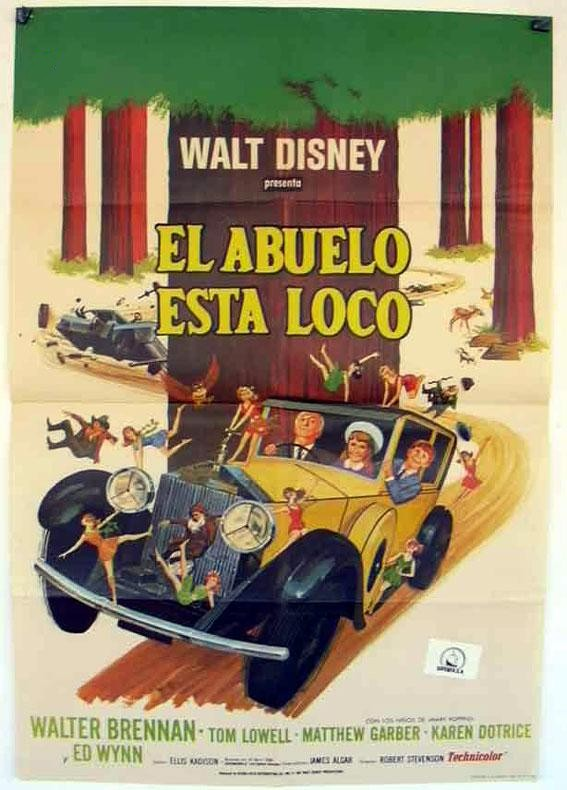

# Preliminaries

## Reminders 

<!--

# Notes to self

## Pedagogy

- Focus relentlessly on the arguments.
- Allow distinctions to arise out of objections.

## Revealjs

- Consider using dynamic slides:
  - Set `contenteditable=true` for each slide
  - See [this
    site](https://www.xjavascript.com/blog/add-remove-slides-from-reveal-js-dynamically/)
    for API for creating slides on the fly.
 
---

-   use roughnotation to draw around items for focus
-   use attribution for image attribution?
-   use cascade to repeat headings
-   use agenda to automatically transform top level slides into agenda slides

-->

- I have your paragraphs from last week if you haven't picked them up yet (no comments)
- For today, we continue to discuss Chapter 2, "Why You Should Bet on God"
- For next week, the reading is Chapter 3, "What Makes You You?"

# Review

## Expected Utility

The **Expected Utility** of an outcome is the value of that outcome multiplied by its probability:

-   If a raffle gives you a 1% chance of winning $100, the expected utility of playing is $100 $\times$ 0.01 = $1.
-   If you pay $1 for a ticket:
    -   99 out of 100 times you will be out $1.
    -   But 1 out 100 times you will be up $99.

## Mega Millions

The current cash jackpot for the "Mega Millions" lottery is $68.9 million and the odds of winning are 1 in 290,472,336.
A ticket costs $5. Is that a good deal?

---

The probability of winning is:

$$\frac{1}{290,472,336} =  0.00000000344265$$

So the expected utility is about 24¢:

$$68,900,000 \times 0.00000000344265 \approx .237$$

Paying $5 for an expected utility of 24¢ is a bad deal.

---

To break even on a $5 ticket, the jackpot needs to be about $1.45 billion:

$$1,452,369,541 \times 0.00000000344265 \approx 5.00$$

(This ignores taxes, the chance of splitting the jackpot with other winners,
the chance of winning smaller prizes, and the diminishing marginal
utility of money.)

## Decision Matrices

You should choose the action that maximizes your expected utility. To figure out what action this is, you need to consider:

-  **each action** available to you,
-  and, for each action, each **possible outcome** of that action,
-  and, for each outcome, its **expected utility** (that is, its value times its probability)

## Plea Bargain or Trial?

:::{.list-table contenteditable=true aligns="l,r,r,r"}
- - []{.dummy} 
  - win 50%
  - lose 50%
  - Expected Utility
- - fight it
  - 0 years
  - -15 years
  - ?
- - take the plea
  - -5 years
  - -5 years
  - ?
:::

You have been arrested and charged with a crime that carries a 15 year sentence. You can take a plea deal and get that reduced to 5 years, or you can fight it in court.
Your lawyer tells you your chances in court are a toss up. Calculate the expected utilities. What should you do?

## El Abuelo Esta Loco

:::columns

:::{.column width=80%}

You want to watch the 1967 live-action film *The Gnome-Mobile*. You can stream it for $4. Or you
can download a pirated copy. There is a one in a million chance you will get caught, 
and you live in a country with draconian anti-piracy laws, so if you do get caught, you will be fined 
$100,000.

Create a decision matrix and calculate the expected utility of each possible action. What should you do?
:::

:::{.column width=20%}

:::

:::

## The Argument for Betting on God  

:::{.list-table contenteditable=true aligns="l,r,r,r"}
- - []{.dummy} 
  - God ($p_1$)
  - No God ($p_2$)
  - Expected Utility
- - Believe
  - $\infty$ 
  - $f_1$ 
  - $\infty$
- - Don't
  - $f_2$ 
  - $f_3$ 
  - $f_4$
:::

::: {.argument}
- (BG1) One should always choose the option with the greatest expected
  utility.
- (BG2) Believing in God has a greater expected utility than not
  believing in God.
- (BG3) So you should believe in God.
:::

## Believing in God {.smaller}

:::{.list-table contenteditable=true aligns="l,r,r,r"}
- - []{.dummy} 
  - God ($p_1$)
  - No God ($p_2$)
  - Expected Utility
- - Believe
  - $\infty$ 
  - $f_1$ 
  - $\infty$
- - Don't
  - $f_2$ 
  - $f_3$ 
  - $f_4$
:::

Objections:

:::{.columns}
:::{.column width=50%}
-   Infinite good doesn't make sense.
-   The probabilities are unknowable.
-   Believing in God isn't enough to get heaven.
:::
:::{.column width=50%}
-   The rewards of heaven could finite.
-   There are many Gods.
-   Belief isn't voluntary.
:::
:::

## Infinite Goods? {.smaller}

-   If your capacity to enjoy goods is finite, then receiving more goods than can possibly enjoy is not better for you.
-   For many goods, the more goods of that type you enjoy, the less value each one has.
    -   A yacht would make me happier. A second would also increase my happiness, but by a bit less.
    -   Let $y$ be the boost from the first yacht, and suppose each additional yacht boosts my happiness by half as much as the one before:

        $$y + \frac{y}{2} + \frac{y}{4} + \frac{y}{8} + \frac{y}{16} ... = 2y$$

    -   The benefit of infinitely many yachts is not $\infty$, but just $2y$.

## Unknowable Odds

:::{.list-table contenteditable=true aligns="l,r,r,r"}
- - []{.dummy} 
  - God ($p_1$)
  - No God ($p_2$)
  - Expected Utility
- - Believe
  - $\infty$ 
  - $f_1$ 
  - $\infty$
- - Don't
  - $f_2$ 
  - $f_3$ 
  - $f_4$
:::

How do we assign probabilities $p_1$ and $p_2$?

## Other Conditions

:::{.list-table contenteditable=true aligns="l,r,r,r"}
- - []{.dummy} 
  - God ($p_1$)
  - No God ($p_2$)
  - Expected Utility
- - Believe and Pray
  - $\infty$ 
  - $f_1$ 
  - $\infty$
- - Believe and Don't Pray
  - $f_2$
  - $f_3$ 
  - $f_4$
- - Don't Believe or Pray
  - $f_5$ 
  - $f_6$ 
  - $f_7$
:::

## Stingy God

:::{.list-table contenteditable=true aligns="l,r,r,r,r"}
- - []{.dummy} 
  - Generous God 25%
  - Stingy God 25%
  - No God  50%
  - Expected Utility
- - Believe
  - $\infty$ 
  - $f_1$ 
  - $f_2$ 
  - $\infty$ 
- - Don't Believe
  - $f_3$ 
  - $f_4$ 
  - $f_5$ 
  - $f_6$ 
:::

## Many Gods {.smaller}

:::{.list-table contenteditable=true aligns="l,r,r,r,r,r"}
- - []{.dummy} 
  - God~1~ 20%
  - God~2~ 20%
  - God~3~ 20%
  - No God 40%
  - Expected Utility
- - Believe in God~1~
  - $\infty$ 
  - $f_1$ 
  - $f_2$ 
  - $f_3$ 
  - $\infty$ 
- - Believe in God~2~
  - $f_4$ 
  - $\infty$ 
  - $f_5$ 
  - $f_6$ 
  - $\infty$ 
- - Believe in God~3~
  - $f_7$ 
  - $f_8$ 
  - $\infty$ 
  - $f_9$ 
  - $\infty$ 
- - Don't Believe
  - $f_{10}$ 
  - $f_{11}$ 
  - $f_{12}$ 
  - $f_{13}$ 
  - $f_{14}$ 
:::

## Believing isn't Voluntary {.smaller}

The book argues that, even though belief isn't voluntary, you can still adopt the strategy of *trying* to get yourself to believe: go to church, avoid spending time with atheists, pray, read religious texts, etc.

Of course, if you try, there is a chance you will succeed and a chance you will fail:

:::{.list-table contenteditable=true aligns="l,r,r,r,r" }
- - []{.dummy} 
  - God exists and you succeed 25%
  - God exists and you fail 25%
  - God doesn't exist 50%
  - Expected Utility
- - Try\ to\ Believe
  - $\infty$ 
  - $f_1$ 
  - $f_2$ 
  - $\infty$ 
:::

What is the expected utility if you don't try?

# Writing Activity

## Prompt

This is not an essay. This is a thinking-through-writing exercise. I want you to write about whatever it is that you find most puzzling or confusing about the Argument for Betting on God. Try to put your puzzlement or confusion into words, as if you were explaining it to a classmate. If there is something you are struggling to understand, think about what it *might* mean or how it *might* work, and explain those different possibilities, and think about which, if any, seems promising.

## Gather Your Thoughts

:::: {.columns}

::: {.column width="80%"}
Think about whatever it is that you find most puzzling or confusing about the argument. 
What do you find puzzling or confusing about it? Are there ways you might try to understand it? What are those? Why 
are they not quite working out?
:::

::: {.column width="20%"}
:::{.timer #initial-thoughts seconds=60 starton=interaction}
:::
:::

::::

## Share Your Thoughts

:::: {.columns}

::: {.column width="80%"}
Turn to someone, and share your thoughts.
:::

::: {.column width="20%"}
:::{.timer #share seconds=180 starton=interaction}
:::
:::

::::

## Writing

:::: {.columns}

::: {.column width="80%"}
This is not an essay. This is a thinking-through-writing exercise. I want you to write about whatever it is that you find most puzzling or confusing about the argument. 
Try to put your puzzlement or confusion into words, as if you were explaining it to a classmate. If there is something you are struggling to understand, think about what it *might* mean or how it *might* work, and explain those different possibilities, and think about which, if any, seems promising.
:::

::: {.column width="20%"}
:::{.timer #write seconds=300 starton=interaction}
:::
:::

::::

## Sharing

:::: {.columns}

::: {.column width="80%"}
Swap papers with someone. Read each other's papers, then discuss.
:::

::: {.column width="20%"}
:::{.timer #write seconds=300 starton=interaction}
:::
:::

::::

